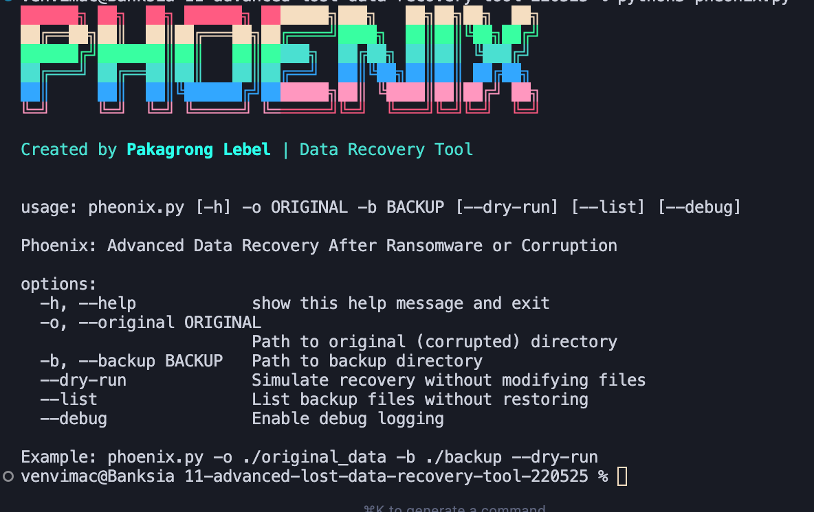

# Phoenix Data Recovery Tool

An advanced data recovery tool for recovering files after ransomware attacks or corruption, featuring both command-line and graphical interfaces.



## Features

- 🔒 File integrity verification using SHA-256 hashing
- 🔄 Backup comparison and recovery
- 🔍 Dry-run mode for safe testing
- 📝 Detailed logging with timestamps
- 🖥️ Modern dark-themed GUI interface
- 💻 Command-line interface for automation
- 🌐 Cross-platform support (Windows, macOS, Linux)

## Installation

### From PyPI (Recommended)

```bash
pip install phoenix-recovery
```

### From Source

```bash
git clone https://github.com/pakagronglb/phoenix-recovery.git
cd phoenix-recovery
pip install -e .
```

## Usage

### Graphical Interface

The GUI version provides an intuitive interface for file recovery operations:

1. Launch the GUI:
   ```bash
   phoenix-gui
   ```

2. Using the GUI:
   - Click "Browse" to select your original (corrupted) directory
   - Click "Browse" to select your backup directory
   - Options:
     - ✓ "Dry Run": Enable to simulate recovery without making changes
     - ✓ "Debug Mode": Enable for detailed logging
   - Actions:
     - "Start Recovery": Begin the recovery process
     - "List Backup Files": View available backup files

The GUI features:
- Dark theme for reduced eye strain
- Real-time progress updates
- Detailed output console
- Error handling with visual feedback
- Multi-threaded operations to prevent GUI freezing

### Command Line Interface

For automation or server environments:

```bash
# Show help and available options
phoenix --help

# Dry run (simulate recovery)
phoenix -o /path/to/corrupted/files -b /path/to/backup --dry-run

# Actual recovery
phoenix -o /path/to/corrupted/files -b /path/to/backup

# List backup files
phoenix -o /path/to/corrupted/files -b /path/to/backup --list

# Enable debug logging
phoenix -o /path/to/corrupted/files -b /path/to/backup --debug
```

### Logging

- Logs are stored in the `logs` directory
- Each session creates a new log file with timestamp
- Log format: `phoenix_YYYYMMDD_HHMMSS.log`
- Debug mode provides detailed operation logging
- Both GUI and CLI share the same logging system

## Best Practices

1. **Always start with dry-run mode**
   - Verify what changes would be made
   - Check the logs for potential issues
   - Ensure correct directory selection

2. **Regular Testing**
   - Test the recovery process periodically
   - Maintain up-to-date backups
   - Verify backup integrity

3. **Security**
   - Keep secure backups offline
   - Use version control when possible
   - Monitor file checksums

## Development

### Requirements

- Python 3.7+
- rich (for CLI formatting)
- tkinter (for GUI, usually comes with Python)

### Setting up Development Environment

1. Clone the repository
2. Create a virtual environment:
   ```bash
   python -m venv venv
   source venv/bin/activate  # On Windows: venv\Scripts\activate
   ```
3. Install development dependencies:
   ```bash
   pip install -e ".[dev]"
   ```

### Running Tests

```bash
python -m pytest tests/
```

## Troubleshooting

### Common Issues

1. **GUI not launching**
   - Ensure tkinter is installed
   - Check Python version compatibility
   - Verify installation in virtual environment

2. **Recovery fails**
   - Check directory permissions
   - Verify backup file integrity
   - Enable debug mode for detailed logs

3. **Performance issues**
   - Consider using CLI for large directories
   - Check available disk space
   - Monitor system resources

## License

MIT License - see LICENSE file for details.

## Contributing

1. Fork the repository
2. Create a feature branch
3. Commit your changes
4. Push to the branch
5. Create a Pull Request

## Credits

Created by Pakagrong Lebel